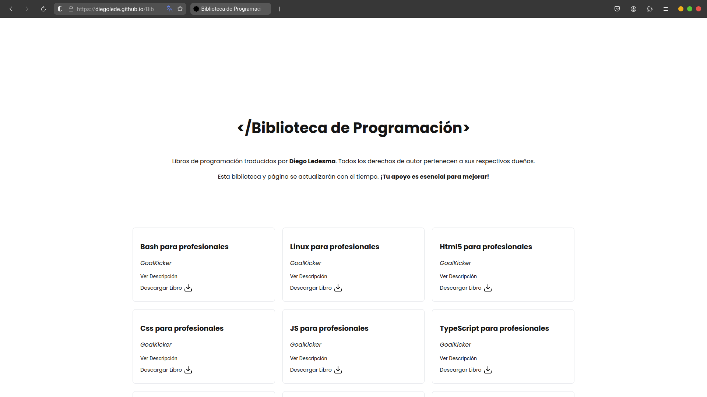

<h1 align="center"><b>Hello :) , I'm Diego Ledesma </b></h1>
<!--  -->

&nbsp;***About me***

I am a self-taught student of frontend programming but I am also interested in cybersecurity, which I will study in the near future.

 I'm currently learning React  
 I really want to collaborate on open source projects following the Linux philosophy. 
 If you need help with something you can ask me without problem. 
I love playing video games.  
 listening to music 
 reading Philosophy books. 
 Contact me at: <a href="diegoledesma9@outlook.com">diegoledesma9@outlook.com</a>

## Tech stack ##

<h4> Languages </h4>
 
  
  
  
  
  
 
<h4> Design tools </h4>
 
 

<h4> tools, technologies and some games. </h4>

  
  
  
  
  
  
  
  
  
  
  
  
  

<h4> Operating systems </h4>

  
  
  
  
  

&nbsp; ***I will continue expanding my knowledge***  
##  Featured Projects
**Free platform with technical books translated into Spanish**  
My passion is sharing knowledge. That's why I offer materials translated into Spanish for free to make learning easier.

  

**a pomodoro timer with a cute little frog that will accompany you in your studies**  

  

## You have reached the end but this will continue

  

